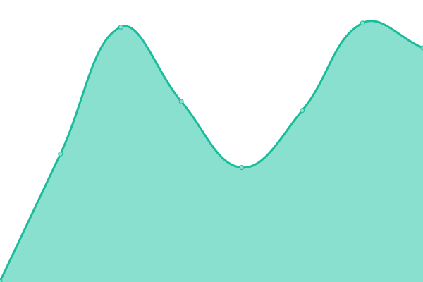

# [📈 Live Status](https://kerala-biodiversity.github.io/upt): <!--live status--> **🟧 Partial outage**

This repository contains the open-source uptime monitor and status page for [Kerala Biodiversity Monitoring Network](www.kbmn.in), powered by [Upptime](https://github.com/upptime/upptime).

With [Upptime](https://upptime.js.org), you can get your own unlimited and free uptime monitor and status page, powered entirely by a GitHub repository. We use [Issues](https://github.com/kerala-biodiversity/upt/issues) as incident reports, [Actions](https://github.com/kerala-biodiversity/upt/actions) as uptime monitors, and [Pages](https://kerala-biodiversity.github.io/upt) for the status page.

<!--start: status pages-->
<!-- This summary is generated by Upptime (https://github.com/upptime/upptime) -->
<!-- Do not edit this manually, your changes will be overwritten -->
<!-- prettier-ignore -->
| URL | Status | History | Response Time | Uptime |
| --- | ------ | ------- | ------------- | ------ |
|  [ferns](https://ferns.org.in) | 🟥 Down | [ferns.yml](https://github.com/kerala-biodiversity/upt/commits/HEAD/history/ferns.yml) | 

 751ms
     
 | 

<a href="https://kerala-biodiversity.github.io/upt/history/ferns">99.88%</a>
    

|  [kbmn](http://www.kbmn.in/) | 🟩 Up | [kbmn.yml](https://github.com/kerala-biodiversity/upt/commits/HEAD/history/kbmn.yml) | 

 286ms
     
 | 

<a href="https://kerala-biodiversity.github.io/upt/history/kbmn">100.00%</a>
    

<!--end: status pages-->

[**Visit our status website →**](https://kerala-biodiversity.github.io/upt)

## 📄 License

- Powered by: [Upptime](https://github.com/upptime/upptime)
- Code: [MIT](./LICENSE) © [Kerala Biodiversity Monitoring Network](www.kbmn.in)
- Data in the `./history` directory: [Open Database License](https://opendatacommons.org/licenses/odbl/1-0/)
